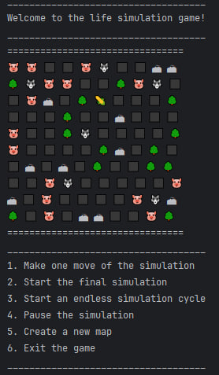

# Simulation of 2d life
A 2D console game that simulates the life of herbivores and predators.
#### Prerequisites: [Java 21](https://jdk.java.net/21/), [Maven](https://maven.apache.org/), Concurrency
## Description
The application was implemented as part of [Sergey Zhukov's roadmap](https://zhukovsd.github.io/java-backend-learning-course/projects/simulation/).



The project includes a two-dimensional map that contains 5 types of creatures: 
* `herbivores` - are looking for grass for food.
* `predators` - are looking for herbivore for food
* `grass` - is food for herbivores.
* `trees` and `rocks` - static objects that cannot be interacted with.

After starting the game, there are the following options:
1. `Make one move of the simulation` - makes one move with the whole world, updates the user interface and waits for the next command.
2. `Start the final simulation` - runs the simulation to the bitter end, when all the herbivores are eaten.
3. `Start an endless simulation cycle` - runs an endless simulation. When all the herbivores are eaten, new ones are added.
4. `Pause the simulation` - pause the simulation if it is running.
5. `Create a new map` - renews the world.
6. `Exit the game` - ends the game.

## Features
* The logic of the game and reading input from the console is divided into `two threads`, which allows for parallel execution.
* A breadth-first search algorithm is implemented to find the path.

## Getting started
### 1. Clone the repository
```shell
git clone https://github.com/floMaxter/simulation-of-life
cd simulation-of-life
```
or download zip archive

https://github.com/floMaxter/simulation-of-life/archive/refs/heads/main.zip

### 2. Run the app using Maven
```shell
mvn package
java -cp .\target\simulation-of-life-1.0-SNAPSHOT.jar com.projects.simulation.Main
```